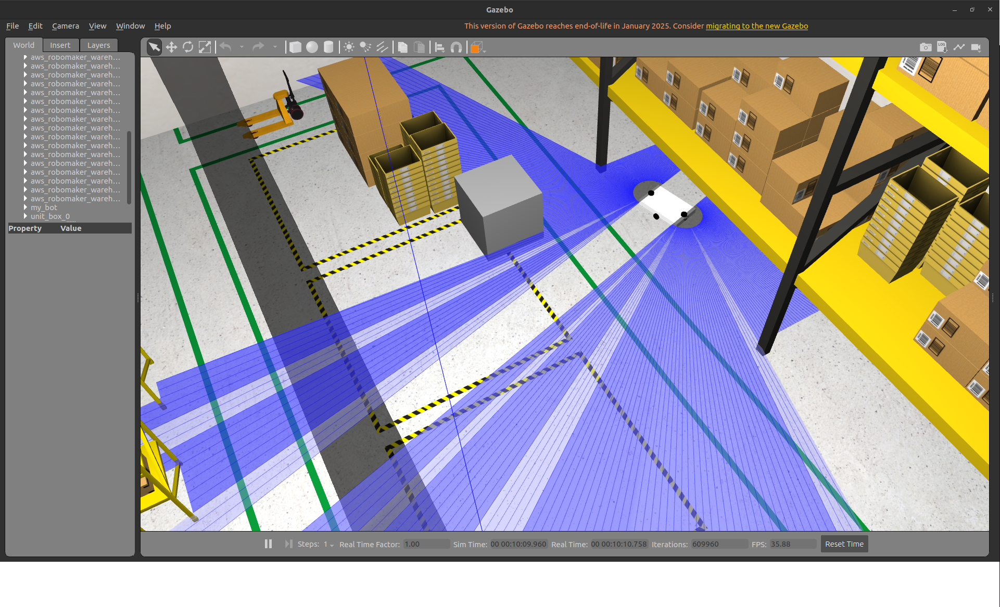
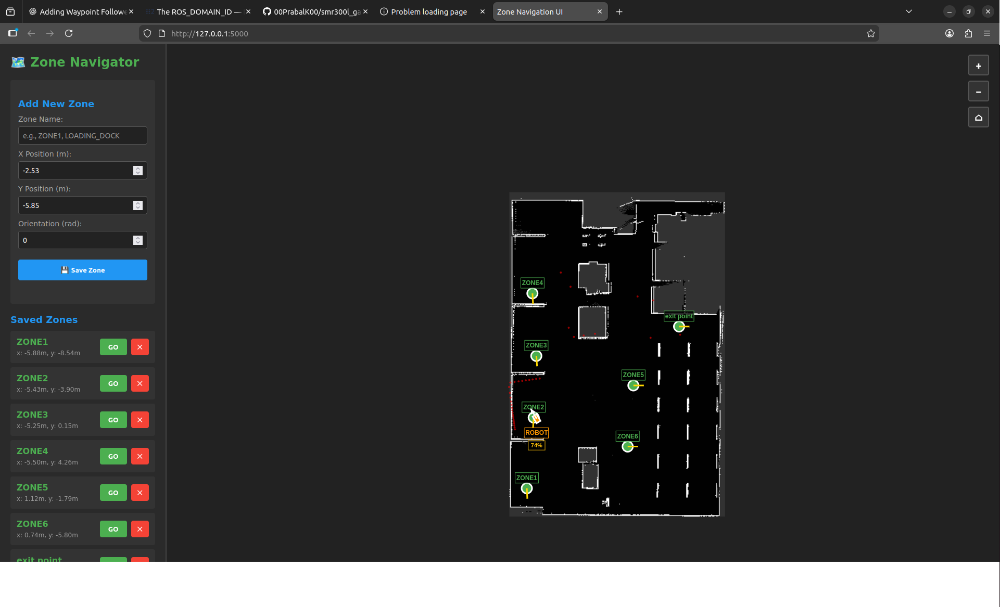
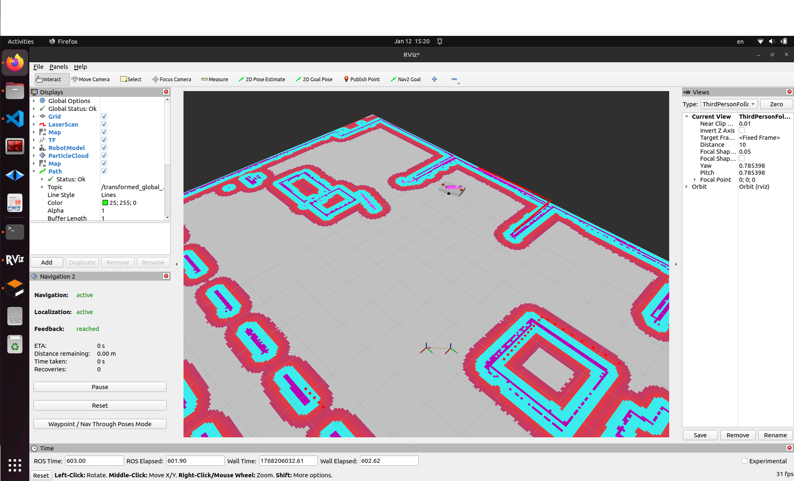

# SMR300L Gazebo ROS2 Control

A comprehensive ROS2 simulation environment for the SMR300L mobile robot with advanced navigation capabilities, real-time visualization, and intelligent safety features through an intuitive web-based interface.

## Overview

This project provides a complete simulation stack for the SMR300L autonomous mobile robot, featuring warehouse navigation with real-time monitoring and safety-critical localization management.

**Technology Stack:**
- **ROS2** (Robot Operating System 2) - Humble/Iron/Jazzy
- **ros2_control** - Hardware abstraction and control
- **Gazebo Classic** - Physics-based simulation
- **Nav2** - Autonomous navigation stack
- **SLAM Toolbox** - Simultaneous localization and mapping
- **Flask Web Server** - Real-time monitoring and control interface
- **AMCL** - Adaptive Monte Carlo Localization


*Warehouse simulation environment in Gazebo Classic*

## Features

### Core Simulation
- Full robot simulation in Gazebo with realistic physics and sensor models
- ROS2 control integration for differential drive control
- SLAM capability for environment mapping
- Autonomous navigation with Nav2 stack
- Joystick/keyboard teleoperation support
- RViz2 visualization with custom configuration

### Advanced Zone Navigation System


*Web-based zone navigation interface with real-time tracking*

#### Real-Time Visualization
- **Live Robot Position** - Updates every 10ms for smooth tracking
- **Navigation Path Display** - Visualizes planned trajectory with waypoints
- **LiDAR Scan Overlay** - Real-time obstacle detection visualization
- **Localization Confidence** - Color-coded percentage display (Green > 80%, Yellow > 50%, Red < 50%)
- **Interactive Map** - Click to set zones, drag to pan, scroll to zoom

#### Zone Management
- **Named Zone Storage** - Save and manage multiple navigation targets
- **One-Click Navigation** - Navigate to saved zones instantly
- **Zone Deletion** - Remove zones with confirmation
- **Persistent Storage** - Zones saved in YAML format

#### Intelligent Safety Features
- **Automatic Safety Stop** - Halts robot when localization confidence drops below 30%
- **Confidence-Based Recovery** - Automatically resumes when confidence exceeds 50%
- **Manual Override** - Force resume navigation when obstacles are physically cleared
- **High-Priority Stop Commands** - Published to `/cmd_vel_joy` topic at 10 Hz to override navigation commands
- **Nav2 Goal Cancellation** - Properly cancels active navigation goals during safety stops
- **Visual Safety Indicators** - Pulsing red border and status labels during safety events

## System Architecture

### Technical Overview

The system integrates multiple ROS2 nodes working in concert:

**Navigation Pipeline:**
```
AMCL (Localization) → Safety Monitor → Zone Manager → Nav2 (Path Planning) → Robot Controllers
```

**Data Flow:**
- `/amcl_pose` - Robot localization with covariance data
- `/scan` - LiDAR sensor data for obstacle detection
- `/plan` - Nav2 computed navigation path
- `/cmd_vel_joy` - High-priority velocity commands (safety override)
- `/goal_pose` - Navigation targets


*RViz displaying robot navigation, LiDAR data, and costmaps*

### Packages Structure

```
smr300l_gazebo_ros2control/
├── my_bot/                    # Main robot package
│   ├── config/                # Configuration files
│   │   ├── my_controllers.yaml       # ros2_control configuration
│   │   ├── nav2_params.yaml          # Navigation parameters (tuned for 20Hz)
│   │   ├── joystick.yaml             # Teleoperation configuration
│   │   └── twist_mux.yaml            # Velocity command multiplexing
│   ├── description/           # Robot URDF/Xacro files
│   │   ├── robot.urdf.xacro          # Main robot description
│   │   ├── ros2_control.xacro        # Control interfaces
│   │   ├── gazebo_control.xacro      # Gazebo plugins
│   │   └── lidar.xacro               # LiDAR sensor configuration
│   ├── launch/                # Launch files
│   │   ├── launch_sim.launch.py      # Full simulation launch
│   │   ├── rsp.launch.py             # Robot state publisher
│   │   └── zone_nav_ui.launch.py     # Web UI server
│   ├── maps/                  # Pre-made maps
│   │   ├── smr_map.yaml              # Map metadata
│   │   └── smr_map.pgm               # Map image
│   └── worlds/                # Gazebo world files
│
└── src/
    ├── zone_nav/              # Zone navigation package
    │   └── zone_nav/
    │       ├── zone_manager.py      # Zone storage and management
    │       ├── zone_web_ui.py       # Flask server + Safety monitor
    │       └── web/templates/
    │           └── index.html       # Real-time web interface
    │
    └── zone_nav_interfaces/   # Custom service definitions
        └── srv/
            ├── SaveZone.srv         # Zone saving service
            └── GoToZone.srv         # Navigation service
```

### Safety System Architecture

**Confidence Calculation:**
The system computes localization confidence from AMCL covariance matrix:
```
confidence = 100 * exp(-sqrt(σ²ₓ + σ²ᵧ))
```

**Safety State Machine:**
1. **Normal Operation** - Confidence > 50%, navigation active
2. **Low Confidence Warning** - 30% < Confidence < 50%, warning displayed
3. **Safety Stop** - Confidence < 30%, robot halted, navigation canceled
4. **Manual Override** - User-initiated resume despite low confidence
5. **Automatic Recovery** - Confidence > 50%, override cleared, normal operation resumed

## Prerequisites

- ROS2 (Humble/Iron/Jazzy recommended)
- Gazebo Classic
- Nav2
- SLAM Toolbox
- Python 3.8+
- Flask (for web UI)

## Installation

### 1. Clone the Repository

```bash
cd ~/Downloads
git clone https://github.com/00PrabalK00/smr300l_gazebo_ros2control.git
cd smr300l_gazebo_ros2control
```

### 2. Install Dependencies

```bash
# Install ROS2 dependencies
sudo apt update
sudo apt install ros-<distro>-gazebo-ros-pkgs ros-<distro>-gazebo-ros2-control
sudo apt install ros-<distro>-nav2-bringup ros-<distro>-slam-toolbox
sudo apt install ros-<distro>-twist-mux ros-<distro>-teleop-twist-keyboard

# Install web UI dependencies
./install_web_ui_deps.sh
# or manually:
pip3 install flask flask-cors pillow pyyaml
```

### 3. Build the Workspace

```bash
colcon build --symlink-install
source install/setup.bash
```

## Usage

### Quick Start (Full System)

Launch everything in separate terminals:

#### Terminal 1: Simulation Environment
```bash
source install/setup.bash
export GAZEBO_MODEL_DATABASE_URI=""
ros2 launch my_bot launch_sim.launch.py use_sim_time:=true
```

#### Terminal 2: Navigation Stack
```bash
source install/setup.bash
ros2 launch nav2_bringup bringup_launch.py \
  use_sim_time:=true \
  map:=./maps/smr_map.yaml \
  params_file:=./config/nav2_params.yaml
```

#### Terminal 3: Zone Navigation Web UI
```bash
source install/setup.bash
ros2 launch my_bot zone_nav_ui.launch.py
```

#### Terminal 4: RViz2 (optional)
```bash
source install/setup.bash
ros2 run rviz2 rviz2 -d config/robot.rviz --ros-args -p use_sim_time:=true
```

### Creating a New Map (SLAM)

If you need to map a new environment:

```bash
# Launch only the simulation (Terminal 1)
ros2 launch my_bot launch_sim.launch.py use_sim_time:=true

# Launch SLAM Toolbox (Terminal 2) - DO NOT run during navigation!
ros2 launch slam_toolbox online_async_launch.py use_sim_time:=true

# Teleoperate the robot (Terminal 3)
ros2 run teleop_twist_keyboard teleop_twist_keyboard --ros-args -r cmd_vel:=/cmd_vel_joy

# Save the map when complete
ros2 run nav2_map_server map_saver_cli -f my_map
```

### Using the Web UI

1. **Access the Interface:** Open browser to `http://localhost:5000`

2. **Save a Zone:**
   - Use the "2D Goal Pose" tool in RViz to set a desired location
   - Enter a descriptive zone name in the web UI (e.g., "LOADING_DOCK", "ZONE1")
   - Set X, Y positions and orientation (in radians)
   - Click "Save Zone" button

3. **Navigate to Zone:**
   - Click the green "GO" button next to any saved zone
   - Monitor navigation progress on the map
   - View real-time path planning (blue dashed line)
   - Observe LiDAR scan data (red dots)

4. **Monitor Robot Status:**
   - **Robot Position:** Live updates every 10ms
   - **Localization Confidence:** Color-coded percentage indicator
     - Green (>80%): Excellent localization
     - Yellow (50-80%): Adequate localization
     - Red (<50%): Poor localization
   - **Navigation Path:** Visualized trajectory with waypoints
   - **LiDAR Data:** Real-time obstacle detection

5. **Safety Features:**
   - **Automatic Safety Stop:** Activates when confidence drops below 30%
   - **Force Resume:** Appears when safety stop is active
     - Use when obstacles are physically cleared
     - Bypasses confidence threshold temporarily
     - Automatically clears when confidence improves to 50%

6. **Zone Management:**
   - Delete zones using the red "X" button
   - Confirmation dialog prevents accidental deletion

## Configuration

### Robot Controllers

Edit [config/my_controllers.yaml](config/my_controllers.yaml) to modify:
- Differential drive parameters
- Joint state broadcaster settings
- Control loop rates

### Navigation Parameters

Edit [config/nav2_params.yaml](config/nav2_params.yaml) to tune:
- **Controller Frequency:** Set to 20Hz for responsive emergency stops
- **Path Planning:** DWB local planner with custom parameters
- **Obstacle Avoidance:** Costmap inflation and obstacle layer configuration
- **Recovery Behaviors:** Backup, spin, and wait behaviors
- **Transform Tolerance:** 0.1s for real-time operation
- **Progress Checker:** 5s movement allowance for challenging areas

**Key Performance Tuning:**
```yaml
controller_server:
  controller_frequency: 20.0  # Fast response for safety stops
  
progress_checker:
  movement_time_allowance: 5  # Reduced from 10s for faster failure detection
  
local_costmap:
  update_frequency: 5.0
  publish_frequency: 2.0
```

### Joystick/Keyboard Control

Edit [config/joystick.yaml](config/joystick.yaml) for input device configuration.

## Web API Endpoints

The zone navigation web server provides REST API for integration:

**Zone Management:**
- `GET /` - Serve web interface
- `GET /api/zones` - List all saved zones with coordinates
- `POST /api/zones/save` - Save new zone (body: `{name, x, y, theta}`)
- `POST /api/zones/goto` - Navigate to zone (body: `{name}`)
- `DELETE /api/zones/delete` - Delete zone (body: `{name}`)

**Robot State:**
- `GET /api/robot/pose` - Current robot pose with confidence
  ```json
  {
    "pose": {"x": -2.5, "y": -5.8, "theta": 0.0},
    "confidence": 85.3,
    "safety_stop": false,
    "override_active": false
  }
  ```
- `GET /api/path` - Current navigation path
- `GET /api/scan` - LiDAR scan data in world coordinates

**Map Data:**
- `GET /api/map/info` - Map metadata (resolution, origin, dimensions)
- `GET /api/map/image` - Base64-encoded map image

**Safety Control:**
- `POST /api/safety/force_resume` - Force resume navigation during safety stop

## Troubleshooting

### Robot Not Moving
**Symptoms:** Robot stationary despite navigation commands

**Solutions:**
- Check controller status: `ros2 control list_controllers`
  - Expected: `diff_cont [active]`
- Verify velocity commands: `ros2 topic echo /diff_cont/cmd_vel_unstamped`
- Check twist_mux priorities: Ensure joystick commands (priority 100) override navigation (priority 10)
- Inspect safety stop status in web UI

### Navigation Failures
**Symptoms:** Robot not reaching goals, path planning errors

**Solutions:**
- **Ensure SLAM Toolbox is NOT running** during navigation (most common issue)
- Verify Nav2 is receiving goals: `ros2 topic echo /goal_pose`
- Check localization quality: `ros2 topic echo /amcl_pose`
- Set initial pose in RViz using "2D Pose Estimate" tool
- Review Nav2 logs: `ros2 launch nav2_bringup bringup_launch.py` (check terminal output)
- Verify map is loaded: `ros2 topic info /map`

### Web UI Issues
**Symptoms:** Interface not loading or updates frozen

**Solutions:**
- Check Flask server running on port 5000: `netstat -tuln | grep 5000`
- Verify ROS2 nodes active: `ros2 node list`
  - Required: `/zone_manager`, `/zone_web_server`
- Check browser console for JavaScript errors (F12 Developer Tools)
- Clear browser cache and reload
- Verify CORS headers in Flask configuration

### AMCL Localization Problems
**Symptoms:** Robot pose not updating, confidence always 0%

**Solutions:**
- **Critical:** Verify QoS settings match (RELIABLE + TRANSIENT_LOCAL)
- Check map is published: `ros2 topic info /map`
- Set initial pose estimate in RViz
- Verify particle filter initialized: `ros2 topic echo /particlecloud`
- Check transform tree: `ros2 run tf2_tools view_frames`
- Review AMCL parameters in `nav2_params.yaml`

### Safety Stop Triggering Unexpectedly
**Symptoms:** Robot stops frequently, low confidence warnings

**Solutions:**
- **Normal behavior:** Confidence drops when LiDAR occluded or in feature-poor areas
- Improve map quality: Re-run SLAM with better coverage
- Adjust confidence threshold in `zone_web_ui.py`:
  ```python
  self.confidence_threshold = 30.0  # Lower for challenging environments
  ```
- Use "Force Resume" button when obstacles physically cleared
- Add visual landmarks to environment for better localization

### Manual Override Not Working
**Symptoms:** Force Resume button doesn't restart navigation

**Solutions:**
- Verify confidence has improved: Check web UI percentage
- Ensure no physical obstacles blocking robot
- Check Nav2 is active: `ros2 topic list | grep navigate_to_pose`
- Review zone_web_ui logs: `ros2 node info /zone_web_server`
- Override automatically clears at 50% confidence - may need to wait

### Build Errors
**Symptoms:** `colcon build` fails

**Solutions:**
- Install missing dependencies: `rosdep install --from-paths src --ignore-src -r -y`
- Source ROS2: `source /opt/ros/<distro>/setup.bash`
- Clean build: `rm -rf build/ install/ log/` then rebuild
- Check Python dependencies: `pip3 install flask flask-cors pillow pyyaml`

## Technical Details

### Update Rates and Performance
- **Robot Pose:** 10ms (100 Hz) - Ultra-smooth tracking
- **Zone List:** 2 seconds - Efficient zone updates
- **Navigation Path:** 200ms (5 Hz) - Real-time trajectory display
- **LiDAR Scan:** 100ms (10 Hz) - Responsive obstacle visualization
- **Safety Stop Timer:** 100ms (10 Hz) - Continuous stop commands
- **Nav2 Controller:** 20 Hz - Fast emergency response

### Communication Topics

**Subscriptions:**
- `/amcl_pose` (PoseWithCovarianceStamped) - Localization with QoS: RELIABLE + TRANSIENT_LOCAL
- `/plan` (Path) - Nav2 computed trajectory
- `/scan` (LaserScan) - LiDAR sensor data

**Publications:**
- `/goal_pose` (PoseStamped) - Navigation targets
- `/cmd_vel_joy` (Twist) - High-priority velocity commands (overrides Nav2)

**Action Clients:**
- `/navigate_to_pose` (NavigateToPose) - Nav2 navigation action

### Twist Multiplexer Priority
Defined in [config/twist_mux.yaml](config/twist_mux.yaml):
```yaml
topics:
  - name: cmd_vel_joy
    topic: cmd_vel_joy
    timeout: 0.5
    priority: 100        # Highest - Safety stop commands
  - name: navigation
    topic: cmd_vel
    timeout: 0.5
    priority: 10         # Lower - Nav2 commands
```

## Screenshots

### Gazebo Simulation Environment

*3D warehouse simulation with realistic physics, lighting, and sensor modeling*

### RViz2 Navigation Visualization

*Real-time visualization showing robot position, LiDAR scans, costmaps, and navigation paths*

### Web-Based Zone Navigator

*Intuitive web interface displaying map, saved zones, robot tracking, and safety status*

## Contributing

Contributions are welcome! Please follow these guidelines:

1. Fork the repository
2. Create a feature branch (`git checkout -b feature/improvement`)
3. Make your changes with clear commit messages
4. Test thoroughly in simulation
5. Submit a pull request with detailed description

**Areas for Contribution:**
- Additional safety features and confidence metrics
- Enhanced path planning algorithms
- Multi-robot coordination
- Real hardware deployment configurations
- Performance optimizations
- Documentation improvements

## License

This project is licensed under the terms specified in the LICENSE file.

## Acknowledgments

- **ROS2 Community** - Comprehensive documentation and support
- **Nav2 Team** - Robust navigation stack architecture
- **AMCL Developers** - Adaptive Monte Carlo Localization implementation
- **Gazebo Team** - Physics simulation environment
- **SLAM Toolbox** - Real-time SLAM implementation
- **Open Robotics** - ROS2 and supporting tools

## Future Enhancements

**Planned Features:**
- Multi-robot coordination and fleet management
- Confidence history visualization with graphs
- Automated obstacle detection confidence metrics
- Emergency stop button (separate from localization-based stop)
- Zone patrol mode with waypoint sequences
- Real hardware deployment support
- Performance analytics and logging
- Mobile-responsive web interface

## Contact

For questions, issues, or feature requests:
- Open an issue on the [GitHub repository](https://github.com/00PrabalK00/smr300l_gazebo_ros2control)
- Check existing issues before creating new ones
- Provide detailed information including ROS2 version, error logs, and steps to reproduce

## Project Status

**Current Version:** 2.0 (January 2026)

**Recent Updates:**
- Added intelligent safety stop system with confidence monitoring
- Implemented manual override for practical obstacle clearing scenarios
- Real-time LiDAR visualization in web interface
- Navigation path display with waypoint markers
- 10ms robot position updates for ultra-smooth tracking
- Enhanced Nav2 parameters for 20Hz controller frequency
- Zone deletion functionality with confirmation dialogs

**Stability:** Production-ready for simulation environments
